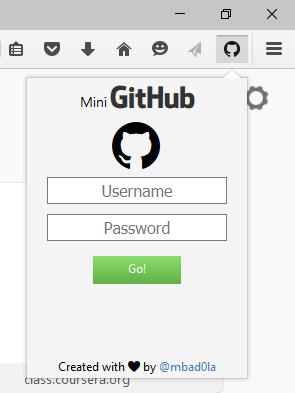
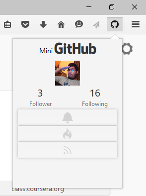
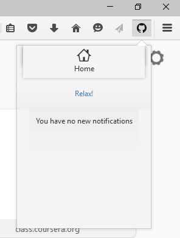
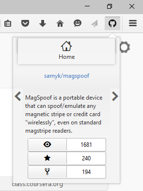
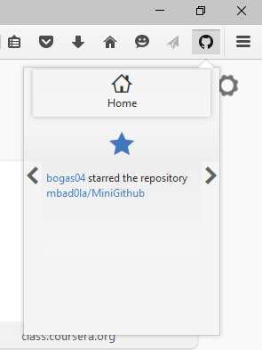

#MiniGithub
A firefox addon facilitating client to stay connected to his account without logging into the github website.

#####Installation
The addon isn't yet listed on Mozilla's Addon website, however you can still install it simply by using [GitHub Extension Installer](https://addons.mozilla.org/en-US/firefox/addon/github-extension-installer/) addon, or by installing it [manually](https://accessfirefox.org/Install_Addon_Manually.php).

#####About the addon

* Compact
* Impressive UI for an addon ( :P )
* Powered by Mozilla's Addon SDK

#####Screenshots

 
 

#####Contributions

Contributions are very much welcome. Please create an issue regarding how you'd like to improve or implement something in the Addon. I'll stay involved with your suggestions and merge viable requests.

Cheers.
